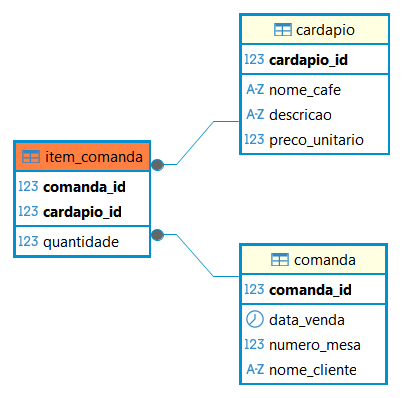

# ☕ Atividade 08 - Modelando, Construindo e Pesquisando

Este repositório documenta a solução para a **Atividade 08**, focada na criação, modelagem e consulta de um banco de dados relacional (PostgreSQL) para gerenciar o sistema de vendas da **Cafeteria BomGosto**.

Todas as instruções DDL (criação de tabelas), DML (inserção de dados de exemplo) e as consultas de solução estão centralizadas no arquivo:

➡️ **[Script_atividade_8.sql](Script_atividade_8.sql)**

---

## ☕ Contexto do Negócio

O objetivo é controlar as vendas de café da Cafeteria BomGosto. O sistema é baseado em:
* **Comandas:** Registram a data, mesa e cliente da venda.
* **Cardápio:** Contém os cafés disponíveis, descrição e preço unitário.
* **Itens da Comanda:** Fazem a ligação entre a Comanda e o Cardápio, registrando a quantidade vendida de cada item.

---

## 🏗️ 1. Estrutura do Banco de Dados (PostgreSQL)

### 🔹 Modelagem de Dados Relacional
O modelo utiliza três tabelas conectadas por chaves estrangeiras, com ênfase em uma **Chave Primária Composta** na tabela `Item_Comanda` para garantir a unicidade dos itens dentro de uma mesma comanda.

### 🔹 Definição das Tabelas (DDL)
A criação das tabelas `Cardapio`, `Comanda` e `Item_Comanda` utiliza tipos de dados e restrições específicas do PostgreSQL, como `SERIAL` para IDs automáticos e `CHECK` para garantir valores positivos.

---

## 📊 2. Consultas de Pesquisa (Análise de Negócio)

As consultas SQL foram desenvolvidas para responder a questões analíticas essenciais sobre as vendas da cafeteria, demonstrando o uso de `JOINs`, `GROUP BY`, funções de agregação (`SUM`, `COUNT`) e filtragem (`HAVING`).

### 🔹 Questão 1 — Simples Listagem e Ordenação
- Demonstra o uso de `SELECT` e `ORDER BY`.

---

### 🔹 Questão 2 — Detalhamento Completo de Vendas
- Demonstra o uso de **três `JOINs`** para listar dados de todas as tabelas em um único resultado.

---

### 🔹 Questão 3 — Agregação (Valor Total)
- Demonstra o uso de **`SUM()` e `GROUP BY`** para calcular o total financeiro por comanda.

---

### 🔹 Questão 4 — Filtragem de Grupos (`HAVING`)
- Demonstra a técnica de usar **`COUNT()` em conjunto com `HAVING`** para filtrar apenas as comandas que contêm múltiplos tipos de café.

---

### 🔹 Questão 5 — Faturamento Agregado por Tempo
- Demonstra a análise de **faturamento total agrupado por data**.

---

## 🚀 Execução

Para rodar a solução completa e verificar as consultas:

1.  Garanta que o **servidor PostgreSQL** esteja instalado e rodando.
2.  Use uma ferramenta cliente (como **DBeaver** ou PgAdmin) para conectar ao seu servidor.
3.  Execute o script **`Script_atividade_8.sql`** na ordem:
    * Criação das tabelas (DDL)
    * Inserção dos dados de exemplo (DML)
    * Execução das 5 consultas de análise.

---

## 📖 Conceitos Revisitados

* Modelagem Relacional (Entidade-Relacionamento)
* Integridade de Dados (Chaves Primárias e Estrangeiras, Restrições `CHECK` e `NOT NULL`)
* Linguagem DDL (`CREATE TABLE`) e DML (`INSERT`)
* Junções (`INNER JOIN`)
* Funções de Agregação (`SUM`, `COUNT`)
* Cláusulas `GROUP BY` e `HAVING`